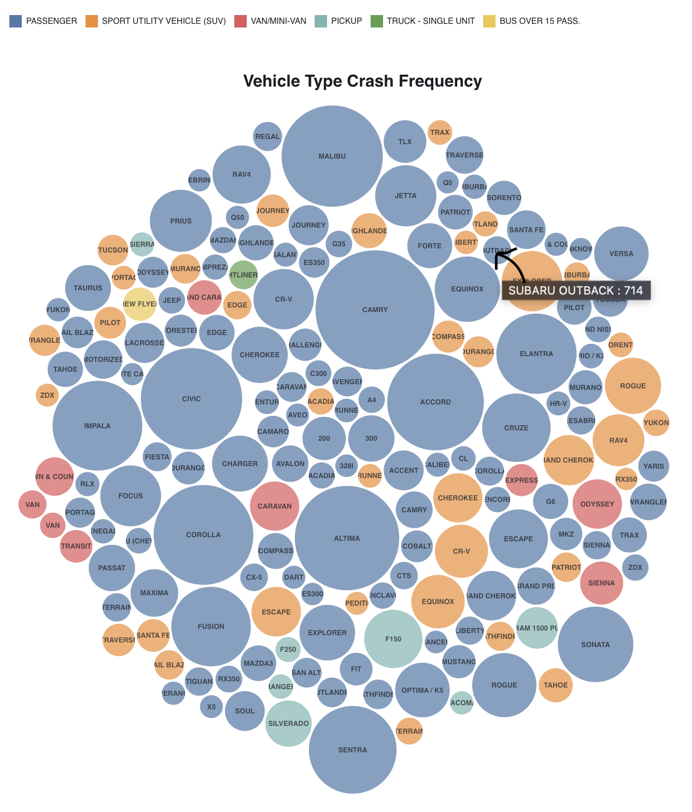
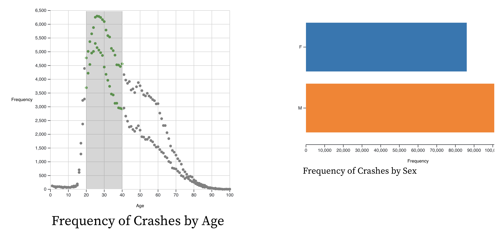
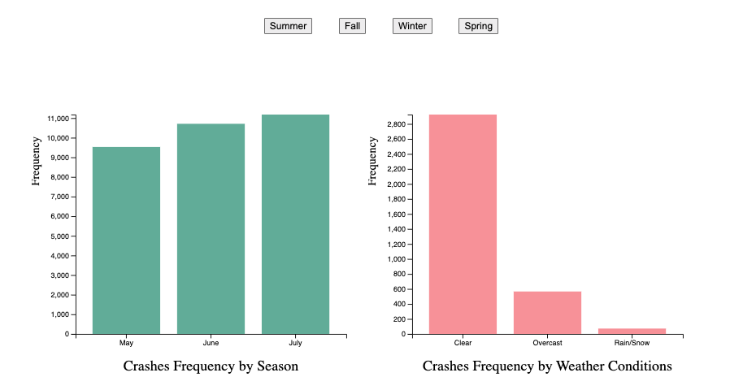
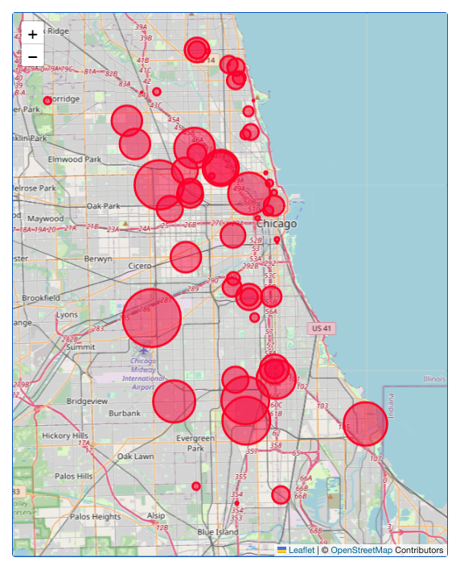

## Overview of the Dataset

We used the Traffic Crashes - Crashes dataset, which has data for the conditions surrounding each crash that took place on the Chicago city streets along with the location and logistics, the Traffic Crashes - People dataset, which contains data about the people involved in the crash, and the Traffic Crashes - Vehicles dataset, which has information regarding the vehicles involved in the traffic crash. 

We merged the three datasets using the common identifier CRASH\_RECORD\_ID which links the same crash in the crashes, vehicles, and people datasets. We wanted to explore specific details about the drivers involved in said crashes, so we filtered the dataset such that each row represents a driver. Furthermore, we wanted to analyze how seasons affect the number of crashes, so we grouped the data by specific months to represent the 4 seasons. This data set was obtained from the City of Chicago Data Portal.

Traffic Crashes - Crashes, The Traffic Crashes - People, and the Traffic Crashes - Vehicles datasets have 674,864, 1,462,740, and 1,358,711 entries respectively, out of which we used data in a time frame spanning two years from, 01/01/2020 - 01/01/2022. We utilized pandas to clean and filter all our data. We dropped any rows without at least 14 non-NA values to clean our data, thus leaving us with a final total of 462,787 rows to work with. We focused on the attributes of the driver, the vehicles they were driving, temporal, weather, and special attributes. To efficiently use aggregation functions with the group by operation, we filtered the data into 4 “mini-dataframes,” one for each visualization with the following attributes:

1. MAKE, MODEL, VEHICLE\_TYPE, FREQUENCY
2. AGE, SEX, FREQUENCY
3. CRASH\_MONTH (divided by the 4 seasons), FREQUENCY
4. LONGITUDE, LATITUDE, FREQUENCY

We aimed to answer our questions using time, distribution, comparison, and spacial visualizations with respect to the aforementioned attributes.

## Questions, Findings, and Visualizations

### [Visualization Website](https://vrawal3.github.io/index.html)

### Domain Question: 
What kinds of drivers are most prone to getting into a vehicular accident? And do external attributes such as seasons or weather conditions contribute to that?

### Question One:
What types of vehicles are heavily involved in crashes? What is the make and model of vehicles that are crashed most frequently? 

#### Process:
For this exploration, we used the attributes, MAKE, MODEL, and VEHICLE\_TYPE and created a new FREQUENCY column. We grouped the data using MODEL and VEHICLE\_TYPE and used sum to get the frequency of accidents. VEHICLE\_TYPEs with frequency greater than a threshold were used for a comprehensive visualization. We chose a bubble plot because it is the most intuitive way to plot so many different MODELs and the easiest to read and analyze. Each MODEL has its own bubble and the area (magnitude) of the bubble indicates the FREQUENCY. We then color-coded (identity) each bubble to represent VEHICLE\_TYPES and included a legend to recognize them. Some bubbles are too small to fully fit the name of the MODEL, so we made them interactive to display a concatenated string of MAKE, MODEL, and FREQUENCY on hovering over the bubble.

#### Visualization:

#### Findings:
Involvement of passenger vehicles (i.e. Toyota Camry) in crashes is significantly higher than any other vehicle type. For the rest, SUVs (i.e. Ford Explorer) are most involved.

### Question Two:
What is the age and sex of drivers most likely to get into a crash?

#### Process:
To answer this question we utilized the AGE and SEX columns and created a new FREQUENCY column. We grouped the data by AGE first and SEX second and utilized the aggregate function sum to add up the frequency values. This allowed us to have the frequency for each sex, M (blue), and F (orange) for each age respectively. To visualize this data, we used the channel position on a common scale (magnitude) to separately plot each SEX on a scatter plot of AGE vs FREQUENCY and we color-coded (identity) them for easy comparison. We also made a bar plot of FREQUENCY vs SEX and integrated it with the scatter plot to make it interactive. The interaction involves you selecting coordinates on the scatter plot using a brush box and the points inside the brush box will be plotted on the bar plot with an aggregate FREQUENCY for each SEX.

#### Visualization:

#### Findings: 
More male-identifying drivers are involved in crashes than females, with the peak being between the ages of 25-30.
More research indicates that men typically drive more miles than women and are more likely to engage in risky driving practices, including not using seat belts, driving while impaired by alcohol, and speeding, which is confirmed by our findings.

### Question Three:
How do seasons and consequent weather conditions affect the frequency of Traffic Crashes?

#### Process:
For this visualization, we first grouped the data by months corresponding to each season - March, April, and May for Spring, June, July, and August for Summer, September, October, and November for Fall, and, December, January, and February for and Winter, for each year 2020 and 2021. We then proceeded to concatenate each season for both years, giving us a combined data set for each season. For our first visualization of the multi-linked visualization, we grouped the data using the CRASH\_MONTH  column to aggregate the FREQUENCY. And for the next part of the multi-linked visualization, we grouped the data by the WEATHER\_CONDITION column to aggregate the FREQUENCY for each season. We used bar graphs for both visualizations, where the length channel is used to visualize the data.

#### Visualization:

#### Findings: 
Most crashes occur during the summer months while the clear weather conditions have seemingly minimal effect. However, during winter months it is evident that there are more crashes that occur due to harsh conditions.

### Question Four:
Which Chicago neighborhood has the highest crash density?

#### Process:
For this visualization, we merged our original dataset with Chicago Boundaries data set on the “ZIPCODE” column. This helped us get rid of incorrect ZIP CODES that were in our original dataset. After the merging, the data was grouped on the “ZIPCODE” column and performed an aggregation of functions on multiple other columns. We performed the “first” function for latitude and longitude and the “sum” function on the “Freq” column to get the total number of accidents for each “ZIPCODE”. This dataset was then converted to a .json array. We took advantage of the source code available on the leaflet website provided by the professor on the handout. Our choice of channel for this visualization was Area which lands right in the middle of the effectiveness scale. We plotted circles with different radii to display the frequency of accidents for the ZIPCODES in Chicago.

#### Visualization:

#### Findings: 
Traffic crashes are concentrated the most near Near North Side moving through the West Side of Chicago, going past Humboldt park. This could largely be due to the large population density in a smaller land area when compared to the suburbs of Chicago. Hence why we can see that there is an accumulation of higher crash frequencies in the South Side of Chicago as well.

#### Findings for the domain question:
Male identifying drivers between the age 25 and 30 who drive a passenger vehicle are most likely to get into a vehicular crash. There is no anomaly for finding depending on specific weather conditions throughout the year, but summer seems to have an effect on the chances of getting into a crash most likely due to the large number of people on the road.
